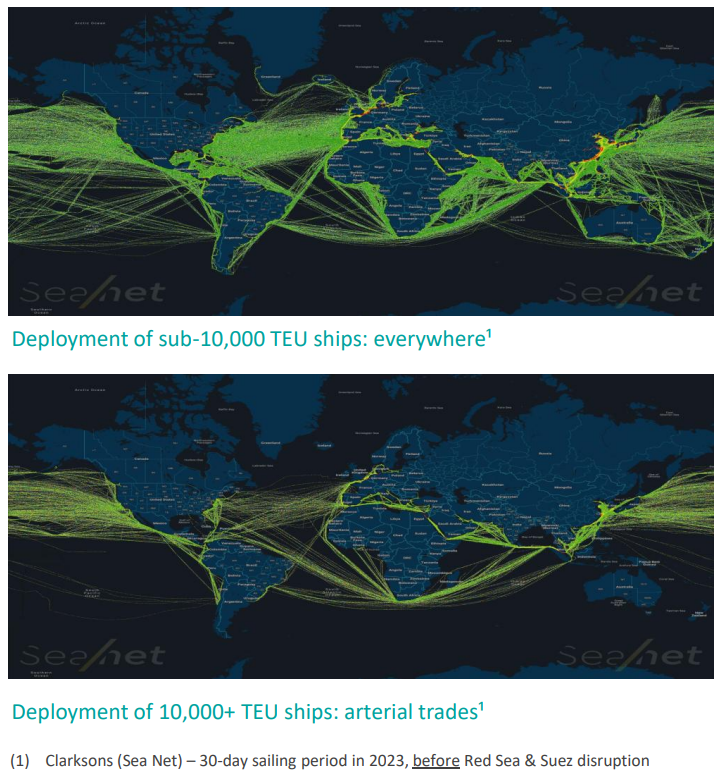

# The Case for Global Ship Lease ([GSL:US](https://finance.yahoo.com/quote/GSL/))

## The Setup

Global Ship Lease doesn't fit neatly into the usual shipping narrative. It's not a mega-carrier playing the mainlane game, and it's not a distressed turnaround story either. It is a company that has spent the better part of a decade cleaning up its balance sheet, locking in long-term charters with tier-one counterparties, and positioning its mid-sized fleet in exactly the segment of the market that today's fragmented trade environment rewards.

The thesis is simple on the surface: GSL trades at sub-3x FY25E earnings and EV/EBITDA, both sitting 30-40% below five-year averages, while generating a 7.0% dividend yield on a payout ratio below 20%. The market is essentially pricing in a sharp rate collapse: one that the company's $1.7 billion contracted revenue backlog makes structurally difficult to engineer before 2027 at the earliest, which is a meaningful cushion in a sector that doesn't usually offer one.

## Why Mid-Sized Vessels Matter Right Now

GSL operates 69 containerships ranging from 2,000 to 11,000 TEU, focused entirely on what the industry calls non-mainlane trades: the routes that account for nearly 75% of global containerized volumes (according to Maritime Strategies International, with the mainlines being Transpacific, Asia-Europe, and Transatlantic) but rarely make headlines. These aren't the behemoth vessels servicing Asia-Europe corridors. They're workhorses, and in the current environment, that's a feature, not a limitation.

Trade fragmentation has made flexibility valuable in ways it wasn't five years ago. As geopolitical tensions push shippers toward shorter, more diversified supply chains, vessels that can access secondary terminals and pivot to emerging lanes have a structural advantage over mega-ships locked into fixed arterial routes. Red Sea disruptions have added another layer: with roughly 10% of global fleet capacity absorbed by Cape of Good Hope rerouting, effective supply has tightened considerably. Demand measured in ton-miles is expected to grow around 6% in 2025 as a direct consequence. There's no obvious near-term resolution in sight.

On the supply side, the picture for sub-10,000 TEU vessels is equally supportive. The median fleet age in this segment sits at around 17.5 years (versus average 7.5 years for over-10,000 TEU ships), and the overall fleet is projected to shrink by over 6% through 2028 as older tonnage exits without being replaced at equivalent scale. New orders in this size category have been limited, which tightens the available pool further. Secondhand values for five-year-old ships are up 17% annually despite softer spot rates, a divergence that signals something the headline rate data doesn't fully capture.

## The Financial Picture

1H25 revenue came in at $383 million, up 8% YoY, with normalized EPS of $5.32 and Adjusted EBITDA of $267mn at roughly 70% margins. The $1.73 billion contracted backlog averages 2.1 years in duration, which means FY26 visibility is effectively already locked in. All 2025 capacity is fixed; 2026 is close to fully covered. Counterparties include Hapag-Lloyd at 27% of revenues, Maersk at 24%, and CMA CGM at 18%; not exactly names that raise credit concerns.

The balance sheet transformation over the past several years deserves more credit than the market appears to be giving it. Adjusted Net Debt/EBITDA has collapsed from 8.4x in 2018 to 0.7x by 2Q25. That's not incremental deleveraging; it's a fundamentally different company. The dividend has been raised 40% since early 2024, yet the payout ratio remains below 20%, which leaves substantial capital available for opportunistic buybacks and eventual fleet renewal. The trailing free cash flow yield exceeds 15%. At sub-3x EBITDA, that's a combination of metrics that's genuinely hard to find.

The US regulatory angle adds a near-term catalyst that the market hasn't fully priced. Rules effective October 2025 now treat vessels under Chinese sale-leaseback structures as Chinese-owned for port fee purposes, discouraging their deployment on US routes. GSL doesn't operate under those structures. The practical effect is a competitive improvement in one of the most important trade corridors in the world, without GSL having to do anything at all.

## Where the Bear Case Lives

The aging fleet is the central concern, and it's legitimate. At 17.5 years average age, GSL's vessels are meaningfully older than the broader market. Maintenance costs move in one direction from here. Management has invested in upgrades, but the underlying reality is that these ships will eventually need replacing.

The post-2026 visibility problem is real as well. The backlog provides genuine insulation through FY27, but renewal rates beyond that depend on market conditions that are inherently speculative. If the Red Sea situation normalizes, rerouting demand evaporates and effective supply increases quickly. If global trade slows materially, charterers gain leverage at renewal.

Client and operational concentration deserve a mention too. Three charterers represent nearly 70% of revenues, and all ship management is outsourced to a single provider, Technomar. Neither relationship has shown signs of stress, but single points of failure in operational structures are worth monitoring.

The honest framing is this: the bear case doesn't invalidate the thesis, but it does mean the investment requires a view on what happens post-2027. The valuation provides a meaningful margin of safety. Whether it's enough depends on assumptions that, at this point, are genuinely open.

## The Bottom Line

At sub-3x earnings and EBITDA, with a contracted backlog that insulates the next two years of cash flows, a 7.0% yield on a conservative payout, a near-zero leverage position, and a fleet that sits in exactly the size segment most favored by today's trade dynamics, GSL offers a risk-reward setup that's difficult to replicate in the current market. The Wall Street coverage is thin (just three brokers), the sector is overlooked, and the valuation discount to history is substantial. The longer-term fleet replacement question is real and shouldn't be dismissed. For now, the income, the backlog, and the structural positioning do most of the heavy lifting.
